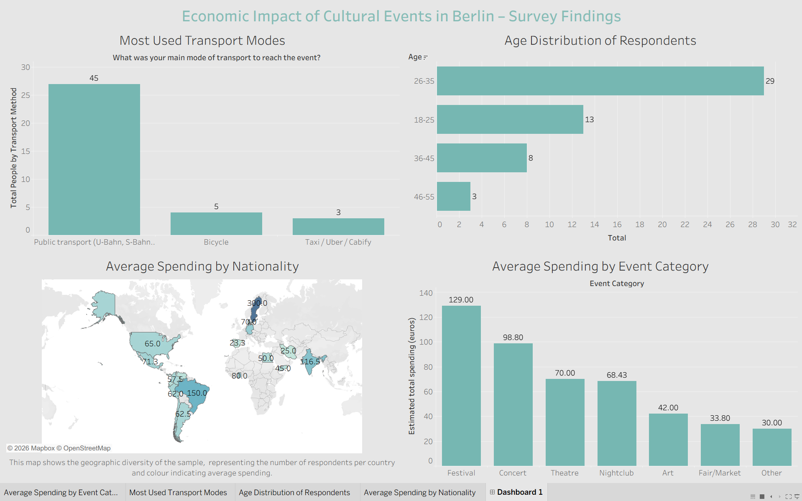

# Thesis Berlin: Economic Impact of Cultural Events

**Master's Thesis in Data Analytics**

This repository contains the SQL scripts used to create and manage the database for my master's thesis on the economic impact of cultural events in Berlin.

## 📚 Project Overview

This project analyses survey data from cultural event attendees in Berlin to understand spending patterns, transport choices, and demographic profiles. The data is stored in a normalised MySQL database to facilitate efficient querying and analysis.

**Key components:**
- Survey data from 55 respondents
- Data normalised to Third Normal Form (3NF)
- Tables for respondents, spending, transport choices, and event types
- Foreign key constraints for data integrity

## 🗄️ Database Schema

### Tables

| Table | Description |
|-------|-------------|
| `respondents` | Main table with demographic and survey response data |
| `transport_methods` | Master table of available transport modes |
| `transport_choices` | Links respondents to their selected transport mode |
| `event_types_master` | Master table of cultural event categories |
| `respondent_events` | Links respondents to the events they attended (many-to-many) |
| `spending` | Stores detailed spending breakdown per respondent |

### Entity Relationship Diagram

```
respondents (1) ──┬── (∞) transport_choices
                  ├── (∞) respondent_events
                  └── (∞) spending
```

## 🚀 Getting Started

### Setup Instructions

1. **Clone this repository**
   ```bash
   git clone https://github.com/jorgeevaristo/thesis-berlin.git
   ```

2. **Run the SQL script**
   - Open MySQL Workbench
   - Execute the `create_tables.sql` script
   - The database `thesis_berlin` will be created automatically

3. **Insert reference data**
   - Run the `insert_reference_data.sql` script (see below)

4. **Import survey data**
   - Use the `LOAD DATA INFILE` command or the Python script provided in the repository

## 📊 SQL Scripts

### 1. Create Tables
```sql
DROP DATABASE IF EXISTS thesis_berlin;
CREATE DATABASE thesis_berlin;
USE thesis_berlin;

-- Main Table
CREATE TABLE respondents (
    respondent_id INT PRIMARY KEY AUTO_INCREMENT,
    timestamp DATETIME,
    age VARCHAR(20),
    gender VARCHAR(20),
    nationality VARCHAR(50),
    education VARCHAR(50),
    district VARCHAR(50),
    attended VARCHAR(10),
    frequency VARCHAR(50),
    satisfaction INT,
    motivation VARCHAR(50),
    email VARCHAR(100)
);

-- Transport Methods (exact options as the forms)
CREATE TABLE transport_methods (
    method_id INT PRIMARY KEY AUTO_INCREMENT,
    method_name VARCHAR(100) UNIQUE
);

-- Relation Table: Transport choice by person who answered the survey
CREATE TABLE transport_choices (
    choice_id INT PRIMARY KEY AUTO_INCREMENT,
    respondent_id INT,
    method_id INT,
    travel_time VARCHAR(50),
    travel_district VARCHAR(50),
    FOREIGN KEY (respondent_id) REFERENCES respondents(respondent_id),
    FOREIGN KEY (method_id) REFERENCES transport_methods(method_id)
);

-- Event Types (Same options as the form)
CREATE TABLE event_types_master (
    event_id INT PRIMARY KEY AUTO_INCREMENT,
    event_name VARCHAR(100) UNIQUE
);

-- Relation Table: events by people who answered the survey
CREATE TABLE respondent_events (
    respondent_id INT,
    event_id INT,
    FOREIGN KEY (respondent_id) REFERENCES respondents(respondent_id),
    FOREIGN KEY (event_id) REFERENCES event_types_master(event_id),
    PRIMARY KEY (respondent_id, event_id)
);

-- Expenses Table
CREATE TABLE spending (
    spending_id INT PRIMARY KEY AUTO_INCREMENT,
    respondent_id INT,
    ticket DECIMAL(10,2),
    food_inside DECIMAL(10,2),
    food_outside DECIMAL(10,2),
    other_expenses DECIMAL(10,2),
    total_spend DECIMAL(10,2),
    FOREIGN KEY (respondent_id) REFERENCES respondents(respondent_id)
);
```

### 2. Insert Reference Data
```sql
-- Insert transport methods (same as the forms)
INSERT INTO transport_methods (method_name) VALUES
('Public transport (U-Bahn, S-Bahn, bus, tram)'),
('Bicycle'),
('Car'),
('Taxi / Uber / Cabify'),
('Walking'),
('Other');

-- Insert event types (same as the forms)
INSERT INTO event_types_master (event_name) VALUES
('Music concert (rock, pop, electronic, classical, etc.)'),
('Music festival (e.g., Lollapalooza, Jazz Festival)'),
('Nightclub event'),
('Theatre / Opera / Ballet'),
('Art exhibition / Museum'),
('Cultural fair / Market'),
('Other');
```

### 3. Analysis Queries

#### Total attendees per event type
```sql
SELECT 
    em.event_name,
    COUNT(re.respondent_id) AS total_attendees
FROM event_types_master em
LEFT JOIN respondent_events re ON em.event_id = re.event_id
GROUP BY em.event_name
ORDER BY total_attendees DESC;
```

#### Average spending per event
```sql
SELECT 
    em.event_name,
    COUNT(DISTINCT re.respondent_id) AS num_attendees,
    ROUND(AVG(s.total_spend), 2) AS avg_spend,
    ROUND(SUM(s.total_spend), 2) AS total_spend
FROM event_types_master em
JOIN respondent_events re ON em.event_id = re.event_id
JOIN respondents r ON re.respondent_id = r.respondent_id
JOIN spending s ON r.respondent_id = s.respondent_id
GROUP BY em.event_name
ORDER BY avg_spend DESC;
```

#### Most used transport method
```sql
SELECT 
    tm.method_name,
    COUNT(tc.respondent_id) AS num_people
FROM transport_methods tm
LEFT JOIN transport_choices tc ON tm.method_id = tc.method_id
GROUP BY tm.method_name
ORDER BY num_people DESC;
```

#### Average spending by nationality (Top 10)
```sql
SELECT 
    r.nationality,
    COUNT(*) AS num_people,
    ROUND(AVG(s.total_spend), 2) AS avg_spend
FROM respondents r
JOIN spending s ON r.respondent_id = s.respondent_id
GROUP BY r.nationality
ORDER BY avg_spend DESC
LIMIT 10;
```

#### Average spending by age range
```sql
SELECT 
    r.age,
    COUNT(*) AS num_people,
    ROUND(AVG(s.total_spend), 2) AS avg_spend
FROM respondents r
JOIN spending s ON r.respondent_id = s.respondent_id
GROUP BY r.age
ORDER BY avg_spend DESC;
```

#### Relation between event type and transport method
```sql
SELECT 
    em.event_name,
    tm.method_name,
    COUNT(*) AS num_people
FROM event_types_master em
JOIN respondent_events re ON em.event_id = re.event_id
JOIN respondents r ON re.respondent_id = r.respondent_id
JOIN transport_choices tc ON r.respondent_id = tc.respondent_id
JOIN transport_methods tm ON tc.method_id = tm.method_id
GROUP BY em.event_name, tm.method_name
ORDER BY em.event_name, num_people DESC;
```

#### General spending overview
```sql
SELECT 
    COUNT(*) AS total_respondents,
    ROUND(AVG(total_spend), 2) AS avg_spend,
    ROUND(MIN(total_spend), 2) AS min_spend,
    ROUND(MAX(total_spend), 2) AS max_spend,
    ROUND(STD(total_spend), 2) AS std_dev_spend
FROM spending;
```

## 🖼️ Visualisations

### Tableau Dashboard


*Figure 1: Tableau dashboard showing key findings from the survey data.*

### Spending Segments (K-means Clustering)


*Figure 2: Three spending segments identified through K-means clustering.*

### Stripe Simulation Results


*Figure 3: Total simulated revenue by event type from Stripe test environment.*

## 📁 Repository Structure

```
thesis-berlin/
├── README.md
├── create_tables.sql
├── insert_reference_data.sql
├── analysis_queries.sql
├── images/
│   ├── dashboard.png
│   ├── kmeans_segments.png
│   └── stripe_simulation.png
├── data/
│   └── survey_responses.csv
├── notebooks/
│   └── analysis.ipynb
└── docs/
    └── thesis.pdf
```

## 🛠️ Tools Used

- **MySQL** – Database management
- **MySQL Workbench** – Visual database design
- **Python** – Data analysis (pandas, scipy, sklearn)
- **Tableau** – Data visualisation
- **Stripe API** – Payment simulation

## 📊 Key Findings

- **Sample:** 55 respondents from 21 nationalities
- **Average spending:** €72.38 (range: €5–€500)
- **Most popular event type:** Cultural fairs/markets
- **Dominant transport:** Public transport (U-Bahn, S-Bahn, bus, tram)
- **Three spending segments:** Low-medium (69%), Medium-high (24%), High (4%)

## 📝 License

This project is for academic purposes as part of a master's thesis.

## 👤 Author

**Jorge Evaristo** – [GitHub Profile](https://github.com/jorgeevaristo)
